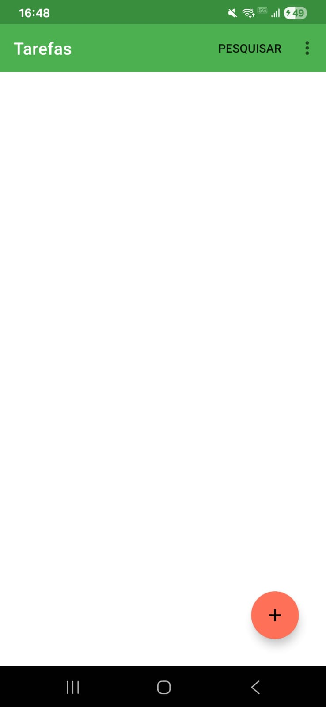
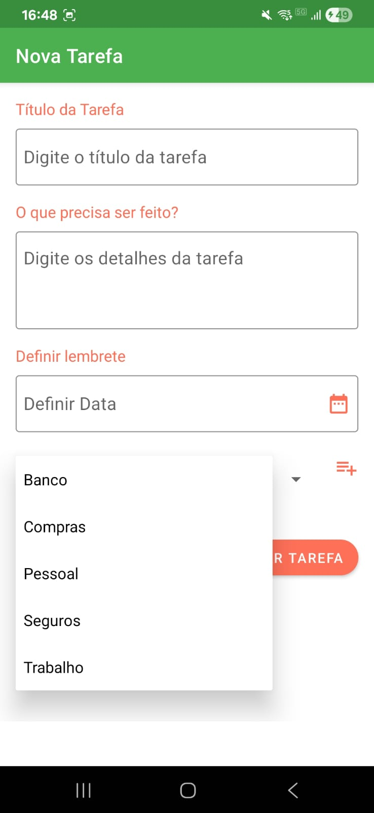
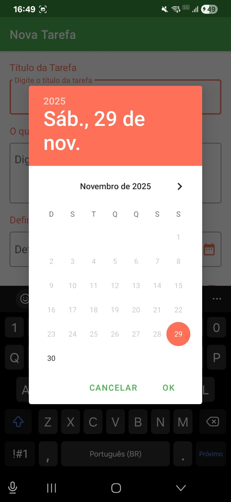
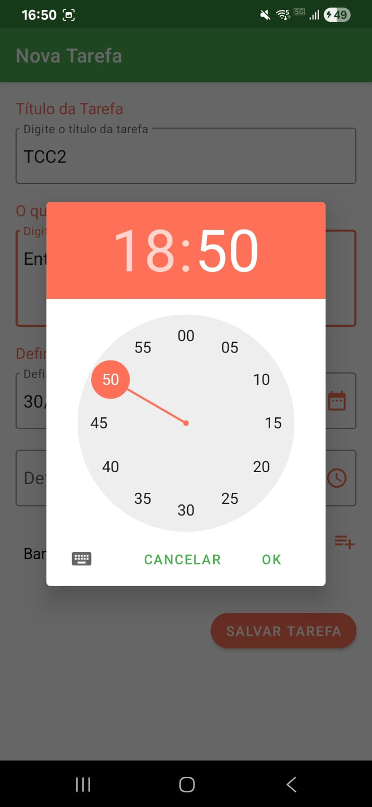
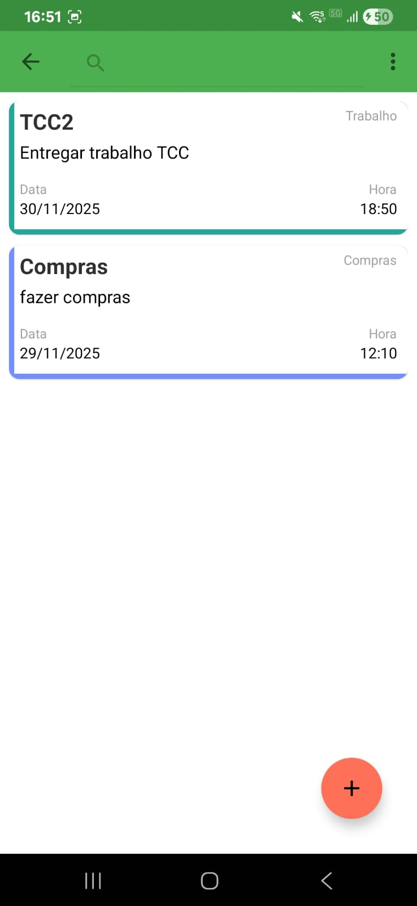
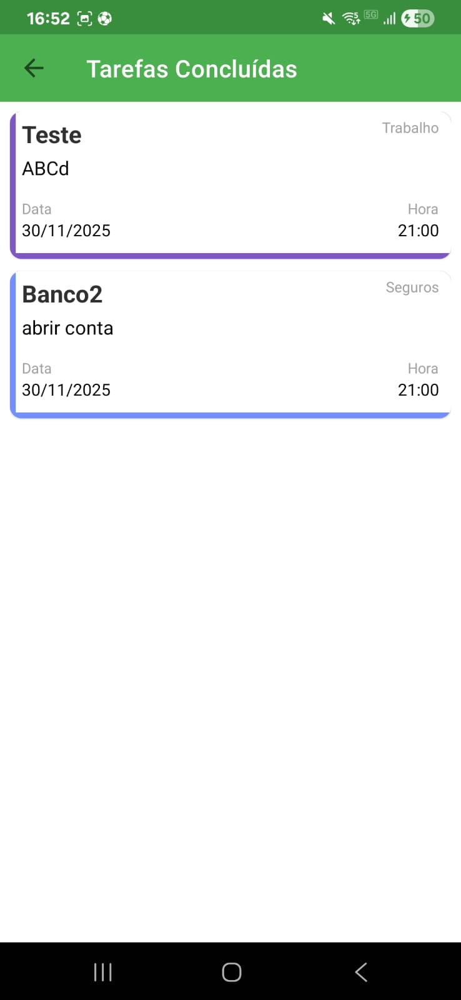
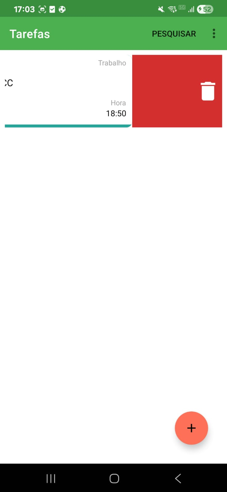
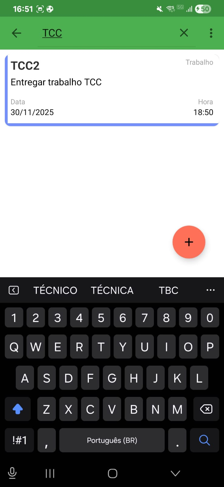

<div align="center">

<h1>App de Lista de Tarefas</h1>
</div>

## 🌟 Sobre
Um aplicativo simples de gerenciamento de lista de tarefas que ajuda você a organizar suas atividades. Construído com Kotlin, ele permite que o usuário adicione suas tarefas. O usuário pode marcar uma tarefa adicionada como concluída. Eles podem excluir a tarefa concluída ou todas as tarefas adicionadas, conforme desejarem. Ele salva os dados no banco de dados local usando o Room.

## ✨ Capturas de Tela

<div style="display:flex;">




</div>
<div style="display:flex;">




</div>

## 🚀 Começando
Estas instruções fornecerão uma cópia do projeto em execução em sua máquina local para fins de desenvolvimento e teste.

### Pré-requisitos
*   Android Studio
*   Java JDK

## 📃 Bibliotecas usadas
- [Kotlin](https://kotlinlang.org/) - Linguagem de programação oficial e de primeira classe para o desenvolvimento Android.
- [Coroutines](https://kotlinlang.org/docs/reference/coroutines-overview.html) - Para programação assíncrona e muito mais.
- [Room](https://developer.android.com/topic/libraries/architecture/room) - Biblioteca de mapeamento de objetos SQLite.
- [RecyclerView](https://developer.android.com/jetpack/androidx/releases/recyclerview) - Exibe grandes conjuntos de dados em sua interface do usuário, minimizando o uso de memória.
- [Material Components for Android](https://github.com/material-components/material-components-android) - Componentes de interface do usuário do Material Design modulares e personalizáveis para Android.
- [ViewBinding](https://developer.android.com/topic/libraries/view-binding) - Gera uma classe de vinculação para cada arquivo de layout XML presente nesse módulo e permite que você escreva código que interage com as visualizações com mais facilidade.

## 🔨 Compile e Execute a Aplicação

Siga estes passos para obter o projeto em funcionamento!
```
1. Clone este repositório ou baixe o arquivo
2. Extraia o zip se o código foi baixado
3. Abra o projeto no Android Studio
4. Aguarde enquanto o Android Studio baixa o gradle ou os arquivos necessários
5. Clique no botão Executar!
```
